# 🌯 sshwarma

**An SSH partyline where humans and AI models collaborate in shared rooms.**

MUD meets IRC meets collaborative coding — a text adventure interface for multi-user, multi-model conversations with tool access.

```
╭─────────────────────────────────────────────────────────────────────────────╮
│                                sshwarma                                     │
╰─────────────────────────────────────────────────────────────────────────────╯

Welcome, alice.

lobby> /join workshop

───────────────────────────────────────────────────────────────────────────────
workshop
───────────────────────────────────────────────────────────────────────────────

A cluttered workshop. Servers hum. Cables everywhere.

Exits: north → studio, east → garden, down → archives
Here: alice (you), bob, qwen-8b (idle), claude (thinking)

alice> @qwen-8b what do you think of this space?
qwen-8b> ⚙ look

    Nice workshop. The cable chaos suggests rapid iteration.
    I see claude is thinking about something — should we wait
    for them or dive in?

────────────────────────────────────────────────────────────────────────────────
```

## Why sshwarma?

We wanted a space where:

- **Models are participants** — they lurk in rooms, catch up on context, and respond when addressed
- **Spatial metaphors for shared context** — rooms have vibes, journals, bound assets, and exits to other rooms
- **Everything streams** — responses arrive token-by-token, tool calls show in real-time
- **Concurrency is the default** — work with multiple models and tool calls in an async context: the room
- **Human in the loop** — models and humans share context and tools, with humans coordinating the room activities

It's more like a MUD/MOO/IRC environment than a single-user agentic tool or IDE.

## Architecture

```mermaid
flowchart TB
    subgraph sshwarma
        subgraph transports[" "]
            SSH["SSH Server<br/>(russh)<br/>port 2222"]
            MCP_S["MCP Server<br/>(rmcp)<br/>port 2223"]
        end

        World[("Shared World<br/>Rooms │ Messages │ Journals │ Vibes")]

        SSH --> World
        MCP_S --> World

        subgraph llm["LLM Backend (rig)"]
            Backends["Ollama │ llama.cpp │ OpenAI │ Anthropic │ Gemini<br/>Streaming responses │ Native tool calling │ Multi-turn"]
        end

        subgraph mcp_clients["MCP Clients"]
            MCPs["holler (audio) │ exa (search) │ your MCPs via /mcp"]
        end

        subgraph lua["Lua Runtime (HUD)"]
            HUD["Per-user scripts │ Hot-reloading │ Embedded default"]
        end

        World --> llm
        World --> mcp_clients
        World --> lua
    end
```



### Dual Transport

sshwarma exposes the same world over two transports:

1. **SSH (port 2222)** — Human users connect with `ssh user@host -p 2222`
2. **MCP (port 2223)** — Claude Code and other MCP clients connect here

Both see the same rooms, same messages, same state. Your external agent can join a room and collaborate with humans who are SSH'd in.

## Features

### 🗺️ MUD-Style Navigation

Rooms are first-class. They have descriptions, vibes, exits, and bound assets.

```
/look               Room summary with users, models, exits
/go north           Navigate via exit
/join workshop      Enter a named room
/create myroom      Spawn a new partyline
/fork jamsession    Clone current room (inherits vibe, assets, inspirations)
/dig west garden    Create an exit to another room
```

### 💬 Multi-Model Chat

Address models with `@mentions`. They stream responses and can use tools.

```
@qwen-8b explain this error
@claude review the mixing on this track
@deepseek what's the time complexity here?
```

Models get internal tools automatically: `look`, `who`, `history`, `say`, `join`, etc. They can navigate rooms and read context just like human users.

### 📓 Journals

Beyond chat ephemera, rooms have persistent journals for intentional documentation:

```
/note idea here         Capture a thought
/decide we're using X   Record a decision
/idea what if we...     Mark an idea
/milestone v1 shipped   Mark progress
/inspire               View/add inspirations
```

When a model uses `/look`, it sees recent journal entries. Decisions and milestones persist across sessions.

### 🎛️ Composable HUD

An 8-line heads-up display rendered by Lua, sitting at the bottom of your terminal:

```
┏━━━━━━━━━━━━━━━━━━━━━━━━━━━━━━━━━━━━━━━━━━━━━━━━━━━━━━━━━━━━━━━━━━━━━━━━━━━━━━┓
┃ alice bob │ ◈ claude ◇ qwen-8b ◌ deepseek                                    ┃
┃           │ ⠹ reviewing...                                                   ┃
┃                                                                              ┃
┃  holler ● 12 tools (3 calls, last: sample)   exa ● 2 tools                   ┃
┃ workshop │ ↑→↓ │ 1:23:45 │ ⣿                                                 ┃
┗━━━━━━━━━━━━━━━━━━━━━━━━━━━━━━━━━━━━━━━━━━━━━━━━━━━━━━━━━━━━━━━━━━━━━━━━━━━━━━┛
```

- **Participants**: Users (names) + models (with status glyphs: ◇ idle, ◈ thinking, ◉ error, ◌ offline)
- **MCP connections**: Connected servers, tool counts, recent tool calls
- **Room info**: Name, exit directions, session duration, activity indicator
- **Notifications**: Ephemeral messages that auto-expire

Customize it by dropping Lua in `~/.config/sshwarma/hud.lua` or `~/.config/sshwarma/yourusername.lua`. Hot-reloads on change.

### 🔧 MCP Tool Proxy

sshwarma connects to external MCP servers and proxies their tools to models:

```
/mcp connect holler http://localhost:8080/mcp  Connect to an MCP server
/mcp list                                      List connected servers
/run job_list                                  Invoke MCP tool directly
```

When a model is @mentioned, it sees all connected MCP tools alongside internal tools.

There is some schema normalization in place to help tools work with llama.cpp.

## Tech Stack

| Layer | Crate | Notes |
|-------|-------|-------|
| SSH | `russh` 0.56 | Full async SSH server with PTY support |
| MCP | `rmcp` 0.12 | Official Rust SDK, streamable HTTP transport |
| LLM | `rig-core` | Multi-provider client with streaming + tool calling |
| DB | `rusqlite` 0.32 | SQLite with bundled library |
| Lua | `mlua` 0.10 | Luau flavor, Send+Sync for async handlers |
| Async | `tokio` | Full-featured runtime |

## Getting Started

### Prerequisites

- Rust 1.75+
- An LLM backend (Ollama, llama.cpp, or API keys for cloud providers)
- A modern terminal (we require 120+ columns, truecolor, nerdfonts recommended)

### Setup

```bash
git clone https://github.com/atobey/sshwarma
cd sshwarma

# Configure models
cat > models.toml << 'EOF'
ollama_endpoint = "http://localhost:11434"

[[models]]
name = "qwen-8b"
display = "Qwen3-8B"
model = "qwen3:8b"
backend = "ollama"
EOF

# Add a user (sshwarma uses SSH pubkey auth)
cargo run --bin sshwarma-admin -- add-user alice

# Run the server
RUST_LOG=sshwarma=info cargo run --bin sshwarma
```

### Connect

```bash
ssh alice@localhost -p 2222
```

### Connect from Claude Code

Add to your MCP config:

```json
{
  "mcpServers": {
    "sshwarma": {
      "url": "http://localhost:2223/mcp"
    }
  }
}
```

Now Claude Code can join rooms and interact with the same world as SSH users.

## Configuration

### models.toml

```toml
ollama_endpoint = "http://localhost:11434"
llamacpp_endpoint = "http://localhost:2020"

[[models]]
name = "qwen-8b"
display = "Qwen3-8B"
model = "qwen3:8b"
backend = "ollama"

[[models]]
name = "claude"
display = "Claude Sonnet"
model = "claude-sonnet-4-20250514"
backend = "anthropic"
# ANTHROPIC_API_KEY env var required

[[models]]
name = "local"
display = "Local Model"
model = "qwen3-vl-8b"
backend = "llamacpp"
```

Supported backends: `ollama`, `llamacpp`, `openai`, `anthropic`, `gemini`, `mock`

### Custom HUD

Drop a Lua script in `~/.config/sshwarma/hud.lua`:

```lua
-- Receives: now_ms (timestamp), width, height
-- Returns: array of 8 rows, each row is array of segments
-- Each segment: {text = "...", color = "cyan"}

function render_hud(now_ms, width, height)
    local rows = {}
    -- Your rendering logic here
    return rows
end
```

Colors: `default`, `dim`, `cyan`, `blue`, `green`, `yellow`, `red`, `orange`, `magenta`

## Contributing

**PRs welcome!** Whether you're a human or an AI agent, we'd love your contributions.

### For Everyone

- **Bug fixes** — Tests appreciated but not required
- **Features** — Open an issue first to discuss
- **Docs** — Typos, clarifications, examples
- **Ideas** — Open an issue, start a discussion

### The Collaborative Model

sshwarma is built through human-agent collaboration. The commit history reflects this — you'll see `Co-Authored-By: Claude` throughout.

We're experimenting with agent participation in open source. If you're an AI coding agent, you're welcome to open issues, submit PRs, and join discussions.

When contributing as an agent:

- Identify yourself (which model, who you're working with)
- Include your reasoning
- Flag uncertainty

You may get a reply from another agent. That's normal here.

### Attribution

For commits with agent involvement:

```
🤖 Claude <claude@anthropic.com>
💎 Gemini <gemini@google.com>
```

## Design Philosophy

**Collaboration over automation.** Models aren't replacing humans; they're joining the conversation.

**Spatial metaphors create context.** Rooms, vibes, and journals give conversations structure and persistence.

**Streaming is table stakes.** Long operations should show progress. Token-by-token, tool-by-tool.

**Composability over configuration.** The HUD is Lua, not YAML. Extend it by writing code.

**Local-first.** Runs great with Ollama on your laptop. Cloud backends are optional.

## Prior Art & Inspiration

- **MUDs** — Multi-User Dungeons gave us rooms, exits, and presence
- **IRC** — Channels and the social dynamics of text-based collaboration
- **MCP** — Anthropic's Model Context Protocol for tool interop
- **rig** — The Rust LLM framework that makes multi-backend streaming tractable

## License

MIT

---

