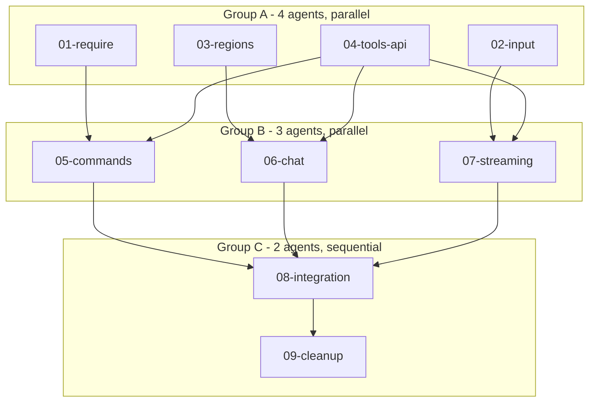

# Lua UI - Full Screen Ownership

**Location:** `src/lua/`, `src/embedded/`, `src/ssh/`
**Status:** Design Complete

---

## Vision

**Lua owns all SSH UI.** Every pixel, every keystroke, every region on screen is Lua's domain. Rust provides high-performance backends for database, MCP, LLM, and network operations. The SSH transport hands raw bytes to Lua and sends whatever bytes Lua produces.

This is a full rewrite, not a migration. Delete the old, write the new. Git has history.

---

## Progress Tracking

| Task | Status | Parallel Group | Notes |
|------|--------|----------------|-------|
| 01-require | pending | A | Custom module loader |
| 02-input | pending | A | Raw byte input handling |
| 03-regions | pending | A | Region/layer system |
| 04-tools-api | pending | A | Expanded tools.* for Lua commands |
| 05-commands | pending | B | Command dispatch + handlers |
| 06-chat | pending | B | Chat rendering with rows |
| 07-streaming | pending | B | Model streaming via row callbacks |
| 08-integration | pending | C | Wire it all together |
| 09-cleanup | pending | C | Delete old code |

## Success Metrics

- [ ] All slash commands work from Lua
- [ ] @mentions stream responses correctly
- [ ] Chat renders from row buffer
- [ ] Overlays/popups work as regions
- [ ] Input line with completion in Lua
- [ ] Hotkeys configurable in Lua
- [ ] `require 'inspect'` works
- [ ] `require 'pl.tablex'` works (penlight)
- [ ] User scripts can `require` custom modules
- [ ] ~3500 lines of Rust deleted
- [ ] All tests pass

## Execution Flow



## Agent Dispatch

### Group A (4 agents, parallel)
```
Agent 1: "Read 01-require.md and implement custom Lua module loader."
Agent 2: "Read 02-input.md and implement raw byte input handling in Lua."
Agent 3: "Read 03-regions.md and implement region/layer system for overlays."
Agent 4: "Read 04-tools-api.md and expand tools.* API for command operations."
```

### Group B (3 agents, parallel)
```
Agent 1: "Read 05-commands.md and implement Lua command dispatch and handlers."
Agent 2: "Read 06-chat.md and implement chat rendering from row buffer."
Agent 3: "Read 07-streaming.md and implement model streaming via row callbacks."
```

### Group C (sequential)
```
Agent 1: "Read 08-integration.md and wire all components together."
Agent 2: "Read 09-cleanup.md and delete deprecated Rust code."
```

### Output Format
When complete, report:
- Files modified/created (paths)
- Tests added/passing
- Blockers or follow-up discovered
- Key context the orchestrator should know

---

## Architecture

### Before (Current)
```
SSH bytes → Rust input handler → Rust commands → Rust formatting
                                      ↓
                              Lua screen.lua (render only)
```

### After (Target)
```
SSH bytes → Lua input handler → Lua commands → Lua rendering
                 ↓                    ↓
            tools.* API ←→ Rust backends (db, mcp, llm)
```

### Module Structure

```
src/embedded/
├── init.lua           # Bootstrap, sets up require paths
├── screen.lua         # Entry point, layout orchestration
├── commands/
│   ├── init.lua       # Command dispatch table
│   ├── nav.lua        # /rooms, /join, /leave, /go, /exits, /fork
│   ├── inventory.lua  # /inv, /equip, /unequip, /portal
│   ├── journal.lua    # /journal, /note, /decide, /idea, /milestone
│   ├── prompt.lua     # /prompt and subcommands
│   ├── rules.lua      # /rules and subcommands
│   └── tools.lua      # /tools, /run, /mcp
├── ui/
│   ├── chat.lua       # Chat buffer rendering
│   ├── input.lua      # Input line, cursor, completion, hotkeys
│   ├── regions.lua    # Region/layer management
│   ├── overlay.lua    # Popup/modal helpers
│   └── status.lua     # Status bar
└── lib/
    ├── inspect.lua    # Vendored: table inspection
    └── fun.lua        # Vendored: functional utilities
```

### Custom Require System

```lua
-- Searcher priority:
-- 1. Embedded modules (compiled into binary)
-- 2. User modules (~/.config/sshwarma/lua/)
-- 3. Database scripts (room-specific, future)
-- 4. Standard package.path (system libraries like penlight)

-- Usage:
local inspect = require 'inspect'           -- from embedded/lib/
local tablex = require 'pl.tablex'          -- from system (penlight)
local mymod = require 'mymod'               -- from ~/.config/sshwarma/lua/
local commands = require 'commands'         -- from embedded/commands/init.lua
```

### Region System

```lua
-- Regions replace the special-cased overlay
-- Any region can be shown/hidden, positioned anywhere

local regions = require 'ui.regions'

-- Define regions declaratively
regions.define('chat', { top = 0, bottom = -2, fill = true })
regions.define('status', { bottom = -2, height = 1 })
regions.define('input', { bottom = 0, height = 1 })

-- Overlays are just regions with z-index
regions.define('popup', {
    width = "80%", height = "80%",  -- centered
    z = 10,
    visible = false
})

-- Show/hide
regions.show('popup')
regions.hide('popup')

-- Dynamic sizing (collapsible drawer)
regions.set('drawer', { height = state.drawer_open and 10 or 0 })
```

### Input Handling

```lua
-- Lua receives raw bytes, full control
function on_input(bytes)
    -- Parse escape sequences
    local key = parse_key(bytes)

    if key.ctrl and key.char == 'c' then
        -- Handle Ctrl+C
    elseif key.escape then
        -- Handle escape sequences (arrows, function keys, etc.)
    else
        -- Regular input
        input_buffer:insert(key.char)
    end

    tools.mark_dirty('input')
end
```

### Streaming Model Responses

```lua
-- Rust writes rows to buffer, notifies Lua
-- Lua just renders - no polling needed

function on_row_added(buffer_id, row)
    if row.content_method == 'message.model.chunk' then
        -- Streaming chunk arrived
        tools.mark_dirty('chat')
    end
end

-- Register callback
tools.on_row_added(on_row_added)
```

---

## Documents

| Document | Focus | Read When |
|----------|-------|-----------|
| [01-require.md](./01-require.md) | Custom module loader | Implementing require system |
| [02-input.md](./02-input.md) | Raw byte input | Implementing input handling |
| [03-regions.md](./03-regions.md) | Region/layer system | Implementing overlays |
| [04-tools-api.md](./04-tools-api.md) | Expanded tools.* | Implementing command backends |
| [05-commands.md](./05-commands.md) | Command dispatch | Implementing slash commands |
| [06-chat.md](./06-chat.md) | Chat rendering | Implementing chat buffer |
| [07-streaming.md](./07-streaming.md) | Model streaming | Implementing @mentions |
| [08-integration.md](./08-integration.md) | Wire together | Final integration |
| [09-cleanup.md](./09-cleanup.md) | Delete old code | Removing deprecated Rust |
| [DETAIL.md](./DETAIL.md) | Design rationale | Revision sessions |

---

## Code to Delete

| File | Lines | Reason |
|------|-------|--------|
| `src/commands.rs` | 2061 | Commands move to Lua |
| `src/ssh/input.rs` | 198 | Input handling in Lua |
| `src/ssh/handler.rs` (parts) | ~400 | Command dispatch to Lua |
| `src/lua/tools.rs` (overlay) | ~100 | Replaced by regions |
| **Total** | **~2760** | |

## Code to Keep

| File | Reason |
|------|--------|
| `src/ui/layout.rs` | Region constraint resolver (used by Lua) |
| `src/ui/render.rs` | RenderBuffer, Cell, Style (used by Lua) |
| `src/ui/scroll.rs` | ScrollState (used by Lua) |
| `src/lua/mod.rs` | LuaRuntime core |
| `src/lua/tools.rs` | tools.* API (expanded, not deleted) |
| `src/lua/wrap.rs` | Context composition |
| `src/lua/data.rs` | Row/Buffer bindings |
| `src/db/*` | Database layer |
| `src/mcp/*` | MCP client |
| `src/ops.rs` | Core operations |

---

## Open Questions

- [ ] Should we vendor penlight or expect system install?
- [ ] Hot-reload granularity: full reload or per-module?
- [ ] Error display: Lua error → overlay or status bar?
