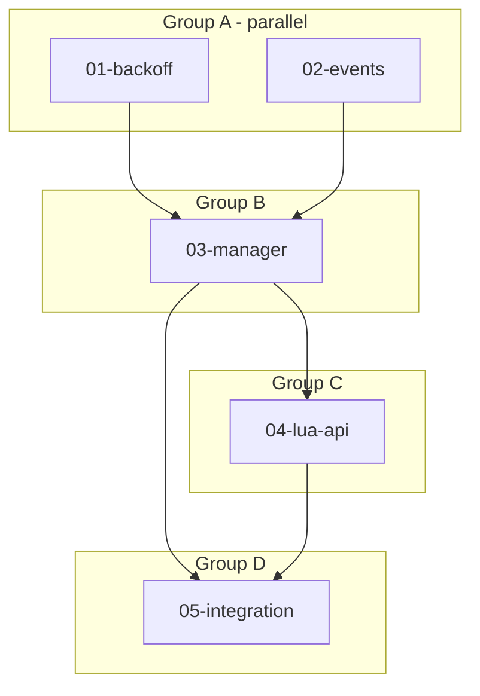

# MCP Connection Manager

**Location:** `src/mcp/` (refactor from `src/mcp.rs`)
**Status:** Design Complete

---

## Summary

Replace the current blocking MCP connection system with a managed, non-blocking architecture where:
- **Lua declares intent** (`mcp_add`, `mcp_remove`, `mcp_status`)
- **Rust manages lifecycle** (connect, retry, reconnect, backoff)
- **HUD receives events** (notifications for status changes)

This enables reliable MCP connections that don't block startup and gracefully handle servers being temporarily unavailable.

---

## Progress Tracking

| Task | Status | Parallel Group | Notes |
|------|--------|----------------|-------|
| 01-backoff | ✅ done | A | No dependencies |
| 02-events | ✅ done | A | No dependencies |
| 03-manager | ✅ done | B | Depends on 01, 02 |
| 04-lua-api | ✅ done | C | Depends on 03 |
| 05-integration | ✅ done | D | Depends on 03, 04 |

## Success Metrics

- [ ] Server starts even when MCP servers are down
- [ ] Connections retry with exponential backoff (100ms → 3s cap)
- [ ] HUD shows connection status changes
- [ ] `startup.lua` with `mcp_add` calls works
- [ ] All existing functionality preserved
- [ ] Tests pass

## Execution Flow



## Agent Dispatch

### Group A (2 agents, parallel)
```
Agent 1: "Read 01-backoff.md and implement."
Agent 2: "Read 02-events.md and implement."
```

### Group B (1 agent)
```
Agent 1: "Read 03-manager.md and implement. Dependencies 01-backoff and 02-events are complete."
```

### Group C (1 agent)
```
Agent 1: "Read 04-lua-api.md and implement."
```

### Group D (1 agent)
```
Agent 1: "Read 05-integration.md and implement. This wires everything together."
```

### Output Format
When complete, report:
- Files modified (paths)
- Tests added/passing
- Blockers or follow-up discovered
- Key context the orchestrator should know

## Documents

| Document | Focus | Read When |
|----------|-------|-----------|
| [01-backoff.md](./01-backoff.md) | Exponential backoff utility | Implementing retry logic |
| [02-events.md](./02-events.md) | Event types and broadcasting | Implementing status events |
| [03-manager.md](./03-manager.md) | McpManager core | Implementing connection lifecycle |
| [04-lua-api.md](./04-lua-api.md) | Lua tool functions | Implementing mcp_add/remove/status |
| [05-integration.md](./05-integration.md) | Wire everything together | Final integration |

## Architecture Overview

```
┌─────────────────────────────────────────────────────────────┐
│                      Lua Control Plane                       │
│   startup.lua: mcp_add("holler", "http://localhost:8080")   │
│                mcp_add("otlp-mcp", "http://localhost:4380") │
└──────────────────────────┬──────────────────────────────────┘
                           │ declares intent (non-blocking)
                           ▼
┌─────────────────────────────────────────────────────────────┐
│                       McpManager                             │
│  ┌─────────────┐    ┌─────────────────────────────────┐    │
│  │   Desired   │    │         Connections              │    │
│  │   State     │───▶│  holler: Connected (47 tools)   │    │
│  │             │    │  otlp-mcp: Reconnecting (2/5)   │    │
│  │  - holler   │    └─────────────────────────────────┘    │
│  │  - otlp-mcp │                                           │
│  └─────────────┘    ┌─────────────────────────────────┐    │
│                     │      Background Tasks            │    │
│                     │  - Connect with backoff          │    │
│                     │  - Reconnect on failure          │    │
│                     └─────────────────────────────────┘    │
└──────────────────────────┬──────────────────────────────────┘
                           │ emits events
                           ▼
┌─────────────────────────────────────────────────────────────┐
│                    Event Subscribers                         │
│   - HUD: shows notifications, connection status             │
│   - Logs: tracing for debugging                             │
└─────────────────────────────────────────────────────────────┘
```

## Lua API

```lua
-- Add connection (non-blocking, idempotent)
tools.mcp_add("holler", "http://localhost:8080/mcp")

-- Remove connection (graceful disconnect)
tools.mcp_remove("holler")

-- Get status of one connection
local status = tools.mcp_status("holler")
-- Returns: { state = "connected", tools = 47, error = nil }
-- States: "connecting", "connected", "reconnecting"
-- Returns nil if not found (use mcp_list to see all)

-- List all connections
local all = tools.mcp_list()
-- Returns: { {name="holler", state="connected", tools=47}, ... }
```

## Design Decisions

- **In-memory state only** — MCP connections are not persisted to DB. `startup.lua` is the source of truth for desired connections; actual state (connected/reconnecting) is runtime-only.
- **Infinite retry** — Connections retry forever with backoff. User can `mcp_remove` to stop retries.
- **Idempotent add** — Calling `mcp_add("x", url)` when "x" already exists with same URL is a no-op. If URL differs, update the endpoint and reconnect.
- **models.toml → Lua** — Out of scope for this session, future work.

## Open Questions

- [ ] Health check interval for detecting silent connection loss? (Future work)
